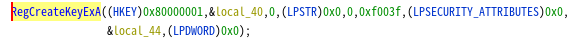
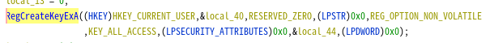

# winapi-ghidra
The development was based on the desire to enable PE to be analyzed quickly.

call_api_table.py is complete. However, auto_equate_setting.py is a prototype. This is being done with a dictionary, but we hope to gradually make it gdt-based.

## call_api_table.py
Lists the address of the CALL that calls the Windows API and its Windows API.

The output is a table, the number of API types and the number of API CALLs.

Clicking on the address will take you to the CALL location, and clicking on the API will take you to the API information in .rdata.

※Caution.

This code does not pick up APIs (such as URLDownloadToFileA) used in Thunk Functions.

## auto_equate_setting.py
Set the correct equate for the API arguments (constants only).However, the following four APIs are supported.
- CreateProcessA
- RegCreateKeyExA
- RegValueExA
- SHGetSpecialFolderPathA

Load api_dict.json

The output is an array of arguments and an array of set equates.

Before

After

The future development process will be twofold.
- Increase dictionaries.
- Migration from dictionary to gdt.

If you are interested in this repository and have a suggestion, please feel free to pull request.
